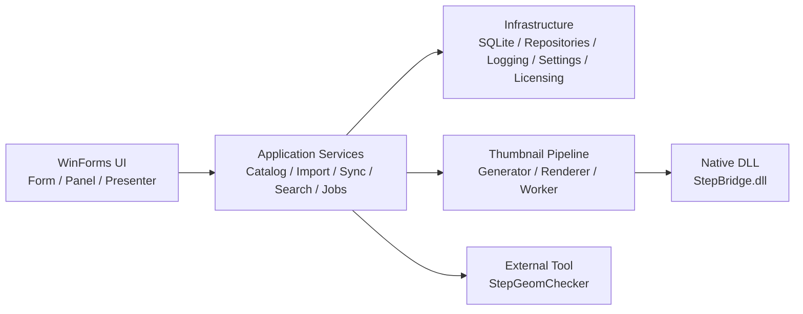

> STEP / IGES / STL を、サムネイル付きで整理・検索。  
> ローカル環境で使える 3D CADデータ管理ソフト、それが GeomCatalog です。

## はじめに

3D CADデータが増えてくると、だんだんこういう状態になりがちです。

- どのフォルダに何があるか分からない
- ファイル名だけでは中身を判断しづらい
- 似たような STEP や STL が増えて探しにくい
- コメントやタグを付けて整理したい
- でも、PDM ほど大きな仕組みはまだ要らない

GeomCatalog は、そうした現場向けに作っている Windows デスクトップアプリです。  
STEP / IGES / STL などの 3D ファイルをローカルの SQLite カタログに登録し、サムネイル付きで一覧表示しながら、表示名、コメント、タグ、お気に入りなどをまとめて管理できます。

## GeomCatalogは何のソフトか

GeomCatalog は、現時点では PDM や PLM を名乗るより、**3D CADデータ管理ソフト** という表現が一番実態に合っています。

役割はシンプルです。

- 3D データを一覧しやすくする
- 中身を見分けやすくする
- 後から探しやすくする
- StepGeomChecker での詳細確認につなげる

つまり、元ファイルをそのままローカルに置いたまま、**探しやすさと整理しやすさを上に足す** ソフトです。

## GeomCatalogでできること

現在の主な機能は次のとおりです。

- STEP / STP / IGES / IGS / STL の取り込み
- サムネイル付きグリッド表示
- 表示名、コメント、タグ、お気に入りの管理
- フォルダ単位での手動同期
- ファイル形式、名前、コメント、パスを対象にした検索
- StepGeomChecker との連携起動
- バックアップ / 復元

画面構成はシンプルで、1画面で流れが完結するようにしています。

- 上: ツールバー
- 左: フォルダツリー
- 中央: サムネイルグリッド
- 右: メタデータ編集パネル
- 下: ステータスバー

「フォルダから探す」「画像で見分ける」「右側で情報を整える」という流れを、できるだけ分かりやすくまとめています。

## どんな場面に向いているか

GeomCatalog は、重厚なPDMやPLMを置き換えるためのソフトというより、まずはローカル環境で 3D データを扱いやすくするためのツールです。

たとえば、次のような場面に向いています。

- 共有フォルダに STEP や STL が増えて一覧性が落ちている
- ファイル名だけでは部品の違いが分かりにくい
- 図面ほど厳密ではないが、コメントやタグで整理したい
- 外部ビューアで詳細確認する前に、まず軽く見渡したい
- 3D データ資産をチーム内で見つけやすくしたい

## GeomCatalogの仕組み

GeomCatalog は、単にフォルダを眺めるだけのソフトではありません。  
実ファイル群の上に、軽量なカタログ層を重ねる構成です。

- 実データ: STEP / IGES / STL などの元ファイル
- カタログ: SQLite データベース
- 補助データ: サムネイルPNG、設定、ライセンスキャッシュ、ログ

カタログ側には、たとえば次の情報を保持します。

- 表示名
- 元ファイル名
- フルパス
- 相対フォルダ
- 形式
- コメント
- タグ
- お気に入り
- サムネイル状態
- 同期状態
- 元ファイルの更新日時

この構成により、**元ファイルはそのまま、見つけやすさだけを強化する** 使い方ができます。

## 技術スタック

実装ベースでは、GeomCatalog は次の構成です。

- UI: .NET 8 / WinForms
- データ保存: SQLite
- サムネイル処理: C# + ネイティブ C++ DLL
- バックグラウンド処理: ジョブキュー + ワーカー
- ライセンス: RSA署名検証 + DPAPIキャッシュ
- 外部連携: StepGeomChecker

STEP / IGES のサムネイル生成には `StepBridge.dll` を使っており、ネイティブ側でメッシュ化や可視エッジ抽出を行い、その結果を C# 側で画像に仕上げています。

## アーキテクチャ概要

内部は大きく次の層に分かれています。

## まとめ

GeomCatalog は、3D CAD データを厳密に管理する大規模システムというより、まずはローカル環境で見つけやすく、整理しやすくするためのツールです。

STEP / IGES / STL をサムネイル付きで一覧し、検索し、必要に応じて StepGeomChecker へつなぐ。  
その流れを、Windows 上で扱いやすくまとめていくことを目指しています。
