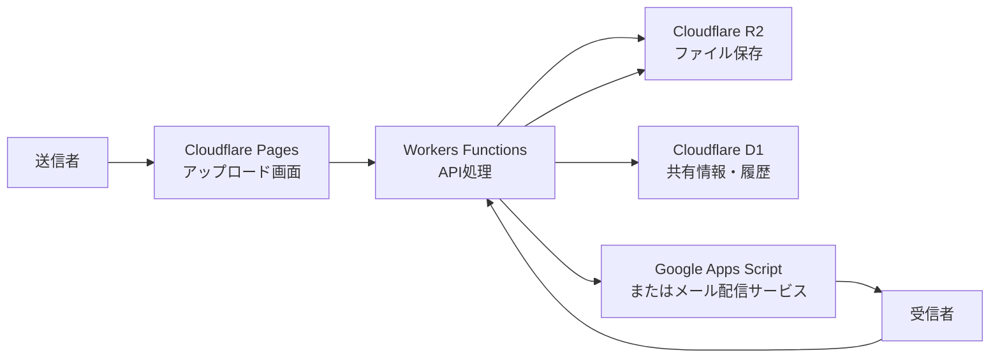

> Cloudflare R2、D1、Workers / Pages を組み合わせると、自社ドメインで使える軽量なファイル共有サービスを構築できます。
> この記事では、LWJ Secure Share の考え方をもとに、公開できる範囲に絞って構成例を整理します。

## はじめに

メール添付では送りにくい大容量ファイルや、パスワード付きZIPを別メールで送る運用は、現場ではまだよく使われています。

ただ、業務で使い続けるには次のような課題があります。

- 添付ファイルの容量制限に引っかかる
- 送信後に共有を止めにくい
- 誰がダウンロードしたか分からない
- URLやパスワードの扱いが属人的になる
- 無料ファイル便では自社ドメインや履歴管理が難しい

そこで、Cloudflare のサービスを使って、**自社ドメインで運用できるファイル共有サービス** を構築する方法を考えます。

LWJ ではこの考え方をもとに、`LWJ Secure Share` という法人向けファイル共有サービスを構成しています。

この記事のコードや設定値は説明用に簡略化したサンプルです。実際の運用環境のURL、バケット名、APIキー、Webhook URL、顧客情報は掲載していません。

## 全体構成

基本構成は次の通りです。



役割を分けると、こうなります。

- Cloudflare Pages: 管理画面、アップロード画面、ダウンロード画面
- Workers Functions: アップロード、共有URL発行、OTP検証、ダウンロード制御
- Cloudflare R2: 実ファイルの保存
- Cloudflare D1: 共有情報、宛先、OTP、履歴、監査ログ
- Google Apps Script: 共有案内メールやOTPメールの送信

小規模な構成なら、サーバーを自前で持たずに始められるのが利点です。

## 保存する情報

ファイル共有サービスでは、ファイルそのものだけでなく、共有状態や履歴も管理します。

最小構成なら、D1には次のようなテーブルを用意します。

```sql
CREATE TABLE IF NOT EXISTS files (
  id TEXT PRIMARY KEY,
  r2_key TEXT NOT NULL,
  original_name TEXT NOT NULL,
  size_bytes INTEGER NOT NULL,
  mime_type TEXT,
  created_at INTEGER NOT NULL,
  expires_at INTEGER NOT NULL,
  deleted_at INTEGER
);

CREATE TABLE IF NOT EXISTS shares (
  id TEXT PRIMARY KEY,
  file_id TEXT NOT NULL,
  token_hash TEXT NOT NULL UNIQUE,
  recipient_email TEXT NOT NULL,
  max_downloads INTEGER NOT NULL DEFAULT 1,
  downloaded_count INTEGER NOT NULL DEFAULT 0,
  status TEXT NOT NULL DEFAULT 'active',
  created_at INTEGER NOT NULL,
  expires_at INTEGER NOT NULL,
  FOREIGN KEY (file_id) REFERENCES files(id)
);

CREATE TABLE IF NOT EXISTS otp_challenges (
  id TEXT PRIMARY KEY,
  share_id TEXT NOT NULL,
  code_hash TEXT NOT NULL,
  recipient_email TEXT,
  attempts INTEGER NOT NULL DEFAULT 0,
  expires_at INTEGER NOT NULL,
  consumed_at INTEGER,
  created_at INTEGER NOT NULL,
  FOREIGN KEY (share_id) REFERENCES shares(id)
);

CREATE TABLE IF NOT EXISTS download_events (
  id TEXT PRIMARY KEY,
  share_id TEXT NOT NULL,
  recipient_email TEXT,
  result TEXT NOT NULL,
  created_at INTEGER NOT NULL,
  FOREIGN KEY (share_id) REFERENCES shares(id)
);
```

実運用では、CC送信、複数ファイル、アドレス帳、レート制限、監査ログ、分割アップロードなども追加します。

## 環境変数の例

Cloudflare Pages / Workers には、URLや上限値を環境変数として設定します。

```text
APP_PUBLIC_BASE=https://share.example.co.jp
API_BASE=https://example-project.pages.dev
ALLOWED_ORIGINS=https://share.example.co.jp,https://example-project.pages.dev

MAX_UPLOAD_MB=1100
MAX_FILE_MB=1000
ALLOWED_UPLOAD_EXTS=pdf,zip,7z,stp,step,igs,iges,dxf,dwg,xlsx,xls,docx,doc,png,jpg,jpeg,txt,csv

OTP_REQUEST_LIMIT_COUNT=5
OTP_REQUEST_LIMIT_WINDOW_MINUTES=15
OTP_VERIFY_LIMIT_COUNT=5
OTP_VERIFY_LIMIT_WINDOW_MINUTES=10

MAIL_WEBHOOK_URL=https://script.google.com/macros/s/xxxxxxxxxxxxxxxx/exec
```

シークレットは通常の環境変数ではなく、Cloudflare の Secret として設定します。

```text
ADMIN_PIN=<set as secret>
OTP_SECRET=<set as secret>
MAIL_WEBHOOK_SECRET=<set as secret>
```

ブログやマニュアルに本番値を載せないことが重要です。

## アップロード処理のサンプル

次は、Workers Functions でファイルを受け取り、R2へ保存し、D1へ共有情報を登録する簡略化サンプルです。

```js
export async function onRequestPost(context) {
  const { request, env } = context;
  const formData = await request.formData();
  const file = formData.get("file");
  const recipientEmail = formData.get("email");

  if (!file || typeof file === "string") {
    return Response.json({ error: "file is required" }, { status: 400 });
  }

  if (!recipientEmail || typeof recipientEmail !== "string") {
    return Response.json({ error: "email is required" }, { status: 400 });
  }

  const now = Math.floor(Date.now() / 1000);
  const fileId = crypto.randomUUID();
  const shareId = crypto.randomUUID();
  const shareToken = crypto.randomUUID();
  const r2Key = `shares/${shareId}/${file.name}`;

  await env.FILES.put(r2Key, file.stream(), {
    httpMetadata: {
      contentType: file.type || "application/octet-stream",
    },
  });

  await env.DB.prepare(`
    INSERT INTO files
      (id, r2_key, original_name, size_bytes, mime_type, created_at, expires_at)
    VALUES
      (?, ?, ?, ?, ?, ?, ?)
  `).bind(
    fileId,
    r2Key,
    file.name,
    file.size,
    file.type || "application/octet-stream",
    now,
    now + 7 * 24 * 60 * 60
  ).run();

  await env.DB.prepare(`
    INSERT INTO shares
      (id, file_id, token_hash, recipient_email, created_at, expires_at)
    VALUES
      (?, ?, ?, ?, ?, ?)
  `).bind(
    shareId,
    fileId,
    await sha256(shareToken),
    recipientEmail,
    now,
    now + 7 * 24 * 60 * 60
  ).run();

  return Response.json({
    shareUrl: `${env.APP_PUBLIC_BASE}/share/${shareToken}`,
  });
}

async function sha256(value) {
  const data = new TextEncoder().encode(value);
  const hash = await crypto.subtle.digest("SHA-256", data);
  return [...new Uint8Array(hash)]
    .map((byte) => byte.toString(16).padStart(2, "0"))
    .join("");
}
```

ポイントは、共有URLに使うトークンをそのままDBへ保存しないことです。DBにはハッシュ化した値を保存します。

## OTP認証の考え方

共有URLだけでダウンロードできる構成は簡単ですが、URLが転送された場合に弱くなります。

そこで、受信者のメールアドレスへワンタイムコードを送信し、次の2つがそろった場合だけダウンロードできるようにします。

- 共有URLを知っている
- 宛先メールで受け取ったOTPコードを知っている

OTPは平文保存せず、こちらもハッシュ化して保存します。

```js
function generateOtp() {
  const array = new Uint32Array(1);
  crypto.getRandomValues(array);
  return String(array[0] % 1000000).padStart(6, "0");
}
```

実運用では、OTPの有効期限、試行回数制限、ロック時間、IPやメールアドレス単位のレート制限も必要です。

## メール送信

小規模な運用では Google Apps Script をメール送信のWebhookとして使う構成も考えられます。

```js
function doPost(e) {
  const payload = JSON.parse(e.postData.contents);

  if (payload.secret !== PropertiesService.getScriptProperties().getProperty("MAIL_WEBHOOK_SECRET")) {
    return ContentService
      .createTextOutput(JSON.stringify({ error: "unauthorized" }))
      .setMimeType(ContentService.MimeType.JSON);
  }

  GmailApp.sendEmail(
    payload.to,
    payload.subject,
    payload.body
  );

  return ContentService
    .createTextOutput(JSON.stringify({ ok: true }))
    .setMimeType(ContentService.MimeType.JSON);
}
```

ただし、GmailやApps Scriptには送信数の上限があります。共有件数が増える場合は、Google Workspace、Postmark、Resendなどの専用メール配信サービスを検討します。

## ダウンロード履歴

ダウンロード時には、成功・失敗を履歴として残します。

```sql
INSERT INTO download_events
  (id, share_id, recipient_email, result, created_at)
VALUES
  (?, ?, ?, ?, ?);
```

履歴があると、次の確認ができます。

- 受信者がダウンロードしたか
- 期限切れで失敗したか
- OTP認証で失敗が続いていないか
- ダウンロード回数制限に達したか

法人間のファイル送付では、この「あとから確認できる」ことがかなり重要です。

## 定期削除

ファイル共有サービスは、ファイル保管サービスとは分けて考えた方が安全です。

期限切れのファイルは、Cloudflare Cron Triggers などで定期的に削除します。

```js
export default {
  async scheduled(event, env, ctx) {
    const expired = await env.DB.prepare(`
      SELECT id, r2_key
      FROM files
      WHERE expires_at < ? AND deleted_at IS NULL
      LIMIT 100
    `).bind(Math.floor(Date.now() / 1000)).all();

    for (const file of expired.results) {
      await env.FILES.delete(file.r2_key);
      await env.DB.prepare(`
        UPDATE files
        SET deleted_at = ?
        WHERE id = ?
      `).bind(Math.floor(Date.now() / 1000), file.id).run();
    }
  },
};
```

R2に残った孤立ファイルを検出する処理や、監査ログの保存期間も決めておくと運用しやすくなります。

## 実運用で必要になる機能

最低限のアップロードとダウンロードだけなら短いコードで作れます。

ただし、業務で使う場合は次のような設計が必要です。

- 管理者認証
- CSRF対策
- アップロード拡張子制限
- ファイルサイズ制限
- OTPの試行回数制限
- ダウンロード回数制限
- 共有停止
- 期限切れ削除
- ダウンロード履歴
- 監査ログ
- CC送信
- アドレス帳
- メール送信上限への対応
- セキュリティヘッダー

LWJ Secure Share では、このような要素を組み合わせて、自社ドメインで使えるファイル共有サービスとして構成しています。

## まとめ

Cloudflare R2 と D1 を使うと、小規模なファイル共有サービスをかなり軽い構成で作れます。

一方で、ファイル共有は「アップロードできる」だけでは業務利用には足りません。
宛先確認、OTP認証、履歴、有効期限、削除、誤送信対策まで含めて設計することで、現場で使いやすい仕組みになります。

LWJでは、こうした自社ドメイン型ファイル共有サービスの構築や運用相談にも対応しています。
